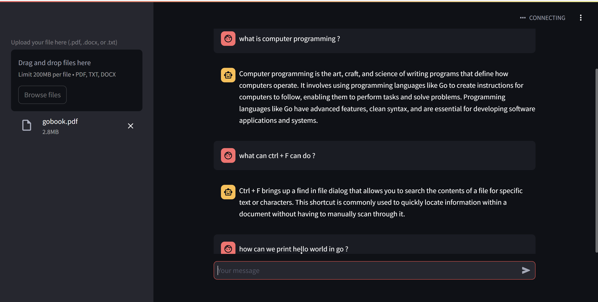

# RAG-IMDB
This project was developed as a basis for practicing LLM and retrieval augemented generation (RAG) built using python with the support of langchain and openai as LLM processing and streamlit for deployment. The project we created is focused on being able to help users in selecting and recommending movies according to what the user wants. Because of this, RAG has an important role in providing context to the model where the context is obtained from the IMDB dataset.

  

## How it works
The app works similarly to other projects that implement RAG. Here you perform a condition where the first time the program is run, the program will look at the history conditions by detecting whether there are vectorstores that were previously created. If not, there will be data preprocessing on the dataset and then the results will be inserted into the embeddings so that the results of the embedd can be inserted into the vector database. Otherwise, the process will be skipped and go directly to the load vector stage in the vector db. The process is done so that later every time a prompt is sent, it does not always do the RAG process which can have an impact on app performance.

## Installation
* prepare the environment and activate it
* install packages `pip install -r requirements.txt`
* run streamlit server `streamlit run main.py`

